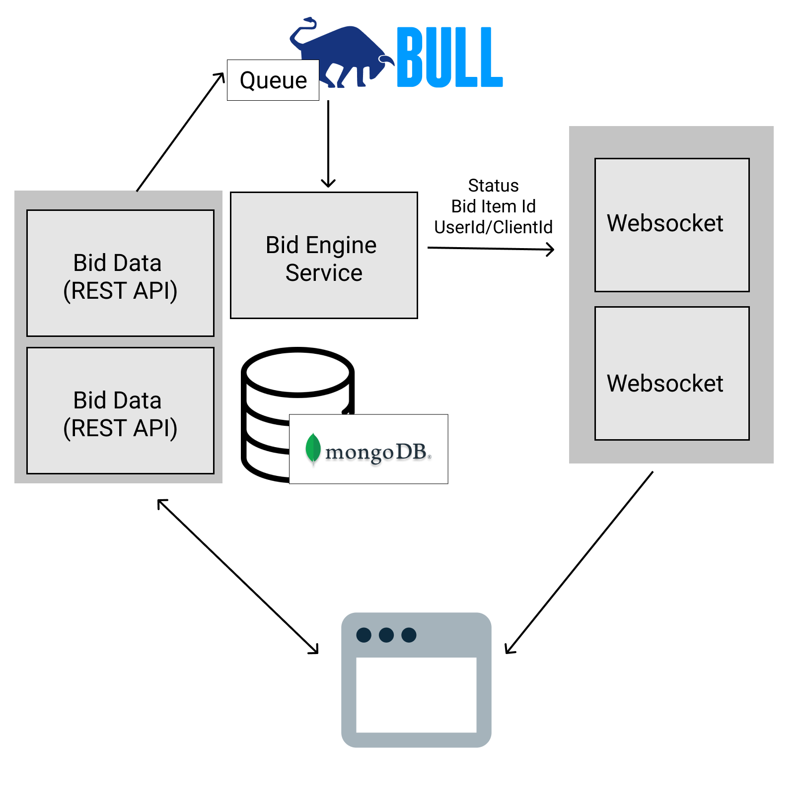

# bid-it

Scaleable Bidding System With Microservices Architecture

## Architecture



1. REST API is a NestJS application. [Source code](apps/bid-it/src/main.ts)
1. Bid Engine is a NodeJS script. [Source code](scripts/engine.js)
1. Websocket server is a NodeJS script. [Source code](scripts/socket.js)

## Installation

There are two ways to run this application:

1. Docker
2. Manual

### 1. Docker

```bash
docker-compose --compatibility up -d
```

This will starts 3 Rest API services with 3 WebSocket servers with Nginx as load-balancer in front them.

You can access the REST API Swagger UI at http://localhost:3000/api

> You can shutdown the services with the command `docker-compose down`

### 2. Manual

#### Prerequisite

1. MongoDB
1. Redis

#### Running The Services

1. Install dependencies.

   ```bash
   yarn install
   ```

1. Adding an `.env` file at the root of the project with the following content:

   ```bash
   DEALS_DB_URL=mongodb://localhost:27017/deal
   USERS_DB_URL=mongodb://localhost:27017/user
   REPORTING_DB_URL=mongodb://localhost:27017/report
   REDIS_URL=redis://localhost:6379
   ```

1. Start all the services.

   ```bash
   yarn start
   ```

1. You can access the REST API Swagger UI at http://localhost:3000/api

## Reports

We use a reporting server ([source](scripts/reporting.js)) listening to Redis event and persists the events to MongoDB.

The reports then can be generated with [`generate-report.js`](scripts/generate-report.js)

## Simulations

### With Docker in Unix environment

1. Start all the services:

   ```bash
   docker-compose --compatibility up -d
   ```

1. Generate test data and simulate 200 concurrent clients performing bidding, and generates reporting in console.

   ```bash
   ./run-simulation.sh
   ```

### Others

1. Start all the services:

   ```bash
   yarn start
   ```

1. (First time only) Generate all the deals:

   ```bash
   yarn setup
   ```

1. Simulate many clients performing bidding:

   ```bash
   yarn simulate
   ```

1. Generate reports:

   ```bash
   yarn report
   ```

## Additional Considerations/Improvements

### Scaleability

1. Both REST API and Websocket servers can be scaled horizontally easily.
1. We use a single queue to be processed by single bid engine. This is to avoid race conditions between bids.
